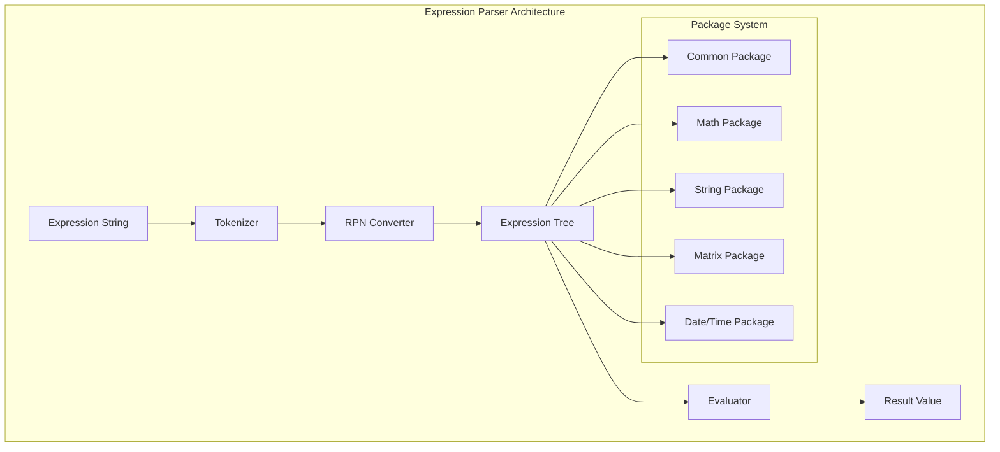
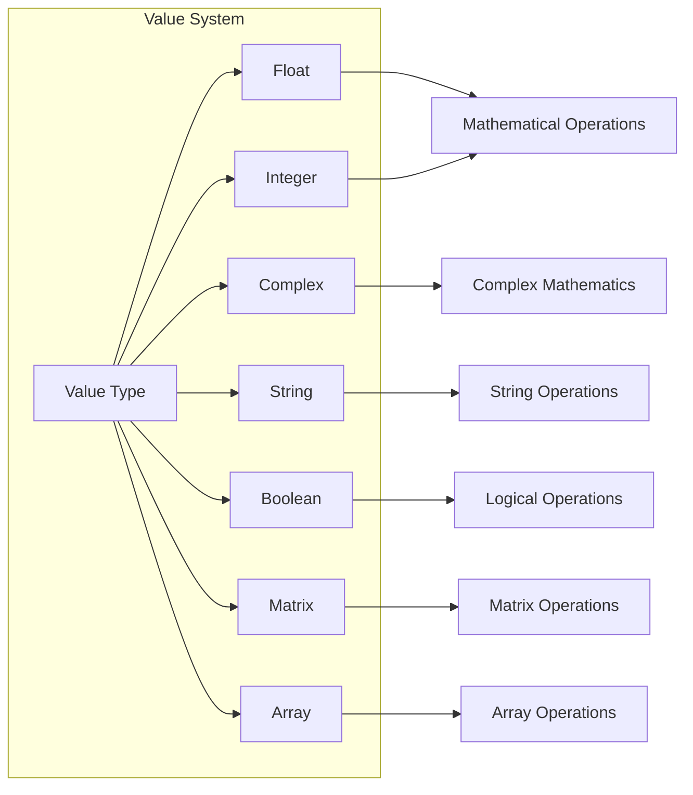

# 🧮 Equations-Parser (muParserX) 

[](https://github.com/beltoforion/muparserx)
[](License.txt)
[]()

A powerful C++ mathematical expression parser library with support for **complex numbers**, **matrices**, **strings**, **date/time operations**, and **60+ built-in functions**. Originally based on muParserX by Ingo Berg, this library provides comprehensive mathematical expression evaluation capabilities.

---

## 🚀 Key Features

- ✅ **60+ Built-in Functions** - Comprehensive mathematical function library
- ✅ **Multiple Data Types** - Numbers, Complex, Strings, Matrices, Arrays
- ✅ **Advanced Operations** - Trigonometry, Logarithms, Date/Time, String manipulation
- ✅ **WebAssembly Ready** - Compile to WASM for web applications
- ✅ **Thread Safe** - Safe for multi-threaded applications
- ✅ **Extensible** - Easy to add custom functions and operators
- ✅ **C++11 Compatible** - Modern C++ features

---

## 📚 Complete Function Reference

### ➕ **Arithmetic Operations**

| Operation | Syntax | Description | Example |
|-----------|--------|-------------|---------|
| Addition | `a + b` | Basic addition | `2 + 3 = 5` |
| Subtraction | `a - b` | Basic subtraction | `5 - 2 = 3` |
| Multiplication | `a * b` | Basic multiplication | `4 * 7 = 28` |
| Division | `a / b` | Basic division | `8 / 2 = 4` |
| Power | `a ^ b` | Exponentiation | `2 ^ 3 = 8` |
| Modulo | `a % b` | Remainder operation | `7 % 3 = 1` |
| Assignment | `a = b` | Variable assignment | `x = 10` |
| Compound Assignment | `+=`, `-=`, `*=`, `/=` | In-place operations | `x += 5` |

### 📐 **Trigonometric Functions**

| Function | Syntax | Description | Domain | Example |
|----------|--------|-------------|--------|---------|
| Sine | `sin(x)` | Sine function | All reals | `sin(π/2) = 1` |
| Cosine | `cos(x)` | Cosine function | All reals | `cos(0) = 1` |
| Tangent | `tan(x)` | Tangent function | x ≠ π/2 + nπ | `tan(π/4) = 1` |
| Arc Sine | `asin(x)` | Inverse sine | [-1, 1] | `asin(0.5) = π/6` |
| Arc Cosine | `acos(x)` | Inverse cosine | [-1, 1] | `acos(0.5) = π/3` |
| Arc Tangent | `atan(x)` | Inverse tangent | All reals | `atan(1) = π/4` |
| Arc Tangent 2 | `atan2(y,x)` | Two-argument arctangent | All reals | `atan2(1,1) = π/4` |

### 〰️ **Hyperbolic Functions**

| Function | Syntax | Description | Example |
|----------|--------|-------------|---------|
| Hyperbolic Sine | `sinh(x)` | Hyperbolic sine | `sinh(1) = 1.175` |
| Hyperbolic Cosine | `cosh(x)` | Hyperbolic cosine | `cosh(0) = 1` |
| Hyperbolic Tangent | `tanh(x)` | Hyperbolic tangent | `tanh(1) = 0.762` |
| Inverse Hyperbolic Sine | `asinh(x)` | Inverse hyperbolic sine | `asinh(1) = 0.881` |
| Inverse Hyperbolic Cosine | `acosh(x)` | Inverse hyperbolic cosine | `acosh(1.5) = 0.962` |
| Inverse Hyperbolic Tangent | `atanh(x)` | Inverse hyperbolic tangent | `atanh(0.5) = 0.549` |

### 📊 **Logarithmic & Exponential Functions**

| Function | Syntax | Description | Domain | Example |
|----------|--------|-------------|--------|---------|
| Natural Logarithm | `ln(x)`, `log(x)` | Base-e logarithm | x > 0 | `ln(e) = 1` |
| Common Logarithm | `log10(x)` | Base-10 logarithm | x > 0 | `log10(100) = 2` |
| Binary Logarithm | `log2(x)` | Base-2 logarithm | x > 0 | `log2(8) = 3` |
| Exponential | `exp(x)` | e raised to x | All reals | `exp(1) = e` |

### 🧮 **Mathematical Functions**

| Function | Syntax | Description | Example |
|----------|--------|-------------|---------|
| Absolute Value | `abs(x)` | Absolute value | `abs(-5) = 5` |
| Square Root | `sqrt(x)` | Square root | `sqrt(16) = 4` |
| Cube Root | `cbrt(x)` | Cube root | `cbrt(27) = 3` |
| Power | `pow(x,y)` | x raised to y | `pow(2,3) = 8` |
| Hypotenuse | `hypot(x,y)` | √(x² + y²) | `hypot(3,4) = 5` |
| Round | `round(x)` | Round to nearest integer | `round(3.7) = 4` |
| Round Decimal | `round_decimal(x,n)` | Round to n decimals | `round_decimal(3.14159,2) = 3.14` |
| Remainder | `fmod(x,y)` | Floating-point remainder | `fmod(7,3) = 1` |
| IEEE Remainder | `remainder(x,y)` | IEEE remainder | `remainder(7,3) = 1` |

### 📝 **String Functions**

| Function | Syntax | Description | Example |
|----------|--------|-------------|---------|
| Concatenate | `concat(s1,s2)` | Join two strings | `concat("Hello"," World") = "Hello World"` |
| Length | `length(s)` | String length | `length("test") = 4` |
| To Uppercase | `toupper(s)` | Convert to uppercase | `toupper("hello") = "HELLO"` |
| To Lowercase | `tolower(s)` | Convert to lowercase | `tolower("WORLD") = "world"` |
| Left Substring | `left(s,n)` | Get leftmost n chars | `left("Hello",3) = "Hel"` |
| Right Substring | `right(s,n)` | Get rightmost n chars | `right("World",3) = "rld"` |
| String to Number | `str2number(s)` | Parse string as number | `str2number("123.45") = 123.45` |
| Number to String | `string(x)` | Convert to string | `string(123) = "123"` |
| Type Conversion | `number(x)` | Convert to number | `number("42") = 42` |
| Contains | `contains(s1,s2)` | Check if s1 contains s2 | `contains("Hello","ell") = true` |
| HTML Link | `link(text,url)` | Create HTML link | `link("Google","http://google.com")` |
| Default Value | `default_value(val,def)` | Return default if null | `default_value(null,"empty") = "empty"` |
| Calculate | `calculate(s)` | Evaluate expression string | `calculate("2+2") = 4` |

### 🔢 **Matrix Functions**

| Function | Syntax | Description | Example |
|----------|--------|-------------|---------|
| Ones Matrix | `ones(rows,cols)` | Matrix filled with ones | `ones(2,3) = [[1,1,1],[1,1,1]]` |
| Zeros Matrix | `zeros(rows,cols)` | Matrix filled with zeros | `zeros(2,2) = [[0,0],[0,0]]` |
| Identity Matrix | `eye(n)` | n×n identity matrix | `eye(2) = [[1,0],[0,1]]` |
| Matrix Size | `size(matrix)` | Get matrix dimensions | `size([[1,2],[3,4]]) = [2,2]` |
| Transpose | `matrix'` | Matrix transpose | `[[1,2],[3,4]]' = [[1,3],[2,4]]` |

### 📊 **Array Functions**

| Function | Syntax | Description | Example |
|----------|--------|-------------|---------|
| Size Of | `sizeof(array)` | Number of elements | `sizeof([1,2,3,4]) = 4` |

### 📅 **Date Functions**

| Function | Syntax | Description | Format | Example |
|----------|--------|-------------|--------|---------|
| Current Date | `current_date()` | Today's date | YYYY-MM-DD | `current_date() = "2023-12-01"` |
| Days Difference | `daysdiff(d1,d2)` | Days between dates | YYYY-MM-DD | `daysdiff("2023-12-01","2023-12-10") = 9` |
| Hours Difference | `hoursdiff(dt1,dt2)` | Hours between datetimes | YYYY-MM-DDTHH:MM | `hoursdiff("2023-12-01T10:00","2023-12-01T15:30") = 5.5` |
| Add Days | `add_days(date,n)` | Add n days to date | YYYY-MM-DD | `add_days("2023-12-01",7) = "2023-12-08"` |
| Week of Year | `weekyear(date)` | ISO week number | YYYY-MM-DD | `weekyear("2023-12-01") = 48` |
| Week Day | `weekday(date)` | Day of week (0=Sunday) | YYYY-MM-DD | `weekday("2023-12-01") = 5` |
| Week Day Localized | `weekday(date,locale)` | Localized day name | Multiple locales | `weekday("2023-12-01","en") = "Friday"` |

### 🕐 **Time Functions**

| Function | Syntax | Description | Format | Example |
|----------|--------|-------------|--------|---------|
| Current Time | `current_time()` | Current time | HH:MM:SS | `current_time() = "14:30:15"` |
| Current Time Offset | `current_time(offset)` | Time with GMT offset | HH:MM:SS | `current_time(-5) = "09:30:15"` |
| Time Difference | `timediff(t1,t2)` | Hours between times | HH:MM:SS | `timediff("10:00:00","15:30:00") = 5.5` |

### 🛠️ **Utility Functions**

| Function | Syntax | Description | Example |
|----------|--------|-------------|---------|
| Mask | `mask(pattern,number)` | Apply formatting mask | `mask("000-000",123456) = "123-456"` |
| Regex | `regex(text,pattern)` | Regex pattern matching | `regex("Hello123","[0-9]+") = "123"` |
| Parser ID | `parserid()` | Parser version info | `parserid() = "muParserX V4.0.7"` |

### ⚖️ **Comparison & Logical Operators**

| Operator | Syntax | Description | Example |
|----------|--------|-------------|---------|
| Greater Than | `a > b` | Comparison | `5 > 3 = true` |
| Less Than | `a < b` | Comparison | `2 < 7 = true` |
| Greater or Equal | `a >= b` | Comparison | `5 >= 5 = true` |
| Less or Equal | `a <= b` | Comparison | `3 <= 4 = true` |
| Equal | `a == b` | Equality | `3 == 3 = true` |
| Not Equal | `a != b` | Inequality | `3 != 4 = true` |
| Logical AND | `a && b`, `a and b` | Logical conjunction | `true && false = false` |
| Logical OR | `a || b`, `a or b` | Logical disjunction | `true || false = true` |
| Logical NOT | `!a` | Logical negation | `!true = false` |
| Bitwise AND | `a & b` | Bitwise conjunction | `5 & 3 = 1` |
| Bitwise OR | `a | b` | Bitwise disjunction | `5 | 3 = 7` |
| Left Shift | `a << b` | Bitwise left shift | `1 << 3 = 8` |
| Right Shift | `a >> b` | Bitwise right shift | `8 >> 3 = 1` |

### ❓ **Conditional Expressions**

| Expression | Syntax | Description | Example |
|------------|--------|-------------|---------|
| Ternary Operator | `condition ? true_val : false_val` | Conditional expression | `5 > 3 ? "yes" : "no" = "yes"` |

### 🔢 **Mathematical Constants**

| Constant | Value | Description |
|----------|-------|-------------|
| `pi` | 3.141592653589793... | Pi (π) |
| `e` | 2.718281828459045... | Euler's number (e) |
| `null` | NULL | Null value |

### 📈 **Aggregation Functions**

| Function | Syntax | Description | Example |
|----------|--------|-------------|---------|
| Minimum | `min(x1,x2,...)` | Smallest value | `min(1,5,2,8) = 1` |
| Maximum | `max(x1,x2,...)` | Largest value | `max(1,5,2,8) = 8` |
| Sum | `sum(x1,x2,...)` | Sum of all values | `sum(1,2,3,4) = 10` |
| Average | `avg(x1,x2,...)` | Average of all values | `avg(1,2,3,4) = 2.5` |

### 🔄 **Type Casting**

| Operator | Syntax | Description | Example |
|----------|--------|-------------|---------|
| Cast to Float | `(float)x` | Convert to floating point | `(float)5 = 5.0` |
| Cast to Integer | `(int)x` | Convert to integer | `(int)3.7 = 3` |
| Factorial | `x!` | Factorial (postfix) | `5! = 120` |

---

## 🏗️ Architecture Overview



---

## 🎯 Expression Examples

### Basic Mathematics
```cpp
// Arithmetic operations
"2 + 3 * 4"                    // Result: 14
"(5 + 3) / 2"                  // Result: 4
"2 ^ 3"                        // Result: 8

// Mathematical functions
"sqrt(16)"                     // Result: 4
"sin(pi/2)"                    // Result: 1
"log10(100)"                   // Result: 2
"abs(-5)"                      // Result: 5
```

### String Operations
```cpp
// String manipulation
"concat('Hello', ' World')"     // Result: "Hello World"
"toupper('hello')"             // Result: "HELLO"
"length('test')"               // Result: 4
"contains('Hello World', 'World')" // Result: true
```

### Date & Time Operations
```cpp
// Date calculations
"current_date()"                              // Result: "2023-12-01"
"daysdiff('2023-12-01', '2023-12-10')"       // Result: 9
"add_days('2023-12-01', 7)"                  // Result: "2023-12-08"
"weekday('2023-12-01')"                      // Result: 5 (Friday)

// Time calculations
"current_time()"                             // Result: "14:30:15"
"timediff('10:00:00', '15:30:00')"          // Result: 5.5
```

### Matrix Operations
```cpp
// Matrix creation and manipulation
"ones(2, 3)"                   // Result: [[1,1,1],[1,1,1]]
"zeros(2, 2)"                  // Result: [[0,0],[0,0]]
"eye(3)"                       // Result: [[1,0,0],[0,1,0],[0,0,1]]
```

### Conditional Logic
```cpp
// Ternary operations
"5 > 3 ? 'yes' : 'no'"         // Result: "yes"
"x = 10; x > 5 ? x * 2 : x / 2" // Result: 20
```

### Complex Expressions
```cpp
// Multi-line expressions
"""
x = 5
y = 3
result = x > y ? sqrt(x^2 + y^2) : abs(x - y)
result
"""                            // Result: 5.831 (hypotenuse)

// Nested function calls
"round_decimal(sin(pi/4) * 100, 2)"  // Result: 70.71
```

---

## 📊 Supported Data Types



---

## 🚀 Integration Examples

### C++ Usage
```cpp
#include "equationsParser.h"

// Basic evaluation
std::string result = EquationsParser::Calc("sin(pi/2)");
// result = "1"

// JSON response with type information
std::string jsonResult = EquationsParser::CalcJson("sqrt(16)");
// jsonResult = {"val":"4","type":"f"}
```

### WebAssembly Integration
```javascript
// JavaScript wrapper usage
const parser = new EquationsParserWrapper();
await parser.initialize();

const result = parser.evaluateEquation("2 + 3 * 4");
console.log(result);
// { value: "14", type: "i", success: true }
```

---

## 🏷️ Version History

| Version | Date | Key Changes |
|---------|------|-------------|
| **4.0.7** | 2016-03-31 | Added `atan2`, `remainder`, `fmod` functions, bug fixes |
| **4.0.5** | 2015-11-20 | New functions: `cbrt`, `hypot`, `pow` for complex numbers |
| **4.0.0** | 2015-06-22 | Major API changes, removed integer constructors |
| **3.0.0** | 2014-05-25 | **C++11 required**, array construction `{1,2,3}`, matrix functions |
| **2.1.0** | 2011-10-16 | Matrix data type, multidimensional index operator |

---

## 📜 License

This library is distributed under the **BSD-2-Clause License** ("Simplified" or "FreeBSD" License).

```
Copyright (C) 2016, Ingo Berg
All rights reserved.

Redistribution and use in source and binary forms, with or without 
modification, are permitted provided that the following conditions are met:

* Redistributions of source code must retain the above copyright notice, 
  this list of conditions and the following disclaimer.
* Redistributions in binary form must reproduce the above copyright notice, 
  this list of conditions and the following disclaimer in the documentation 
  and/or other materials provided with the distribution.
```

---

## 👥 Contributors

- **Ingo Berg** - Original author and maintainer
- **Martin Rotter** - Core contributor  
- **Josh Blum** - Core contributor
- **Community** - Various bug fixes and improvements

---

## 🔗 Links

- **Original Project**: [muParserX](http://muparserx.beltoforion.de)
- **Documentation**: [Full API Documentation](doc/)
- **Examples**: [Sample Code](sample/)
- **Issues**: Report bugs and request features

---

## 🎉 Quick Start

1. **Include the library**
   ```cpp
   #include "equationsParser.h"
   ```

2. **Evaluate expressions**
   ```cpp
   std::string result = EquationsParser::Calc("sin(pi/2) + cos(0)");
   // result = "2"
   ```

3. **Get detailed results**
   ```cpp
   std::string json = EquationsParser::CalcJson("sqrt(16)");
   // json = {"val":"4","type":"f"}
   ```

**Ready to parse complex mathematical expressions with ease!** 🚀